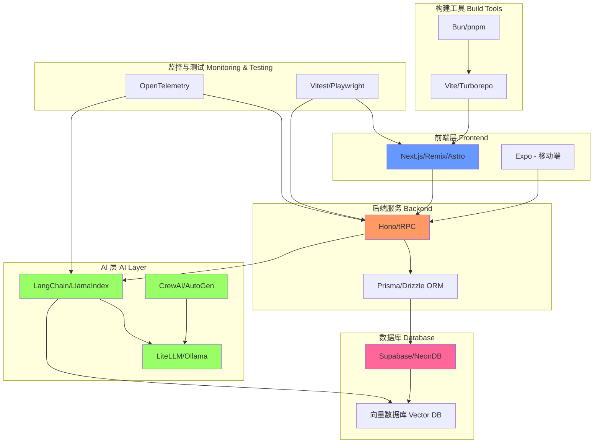

# 🚀 Agent Stack - AI 时代的全栈技术清单

一个面向 AI Agent / AI 应用开发 / 全栈工程化记忆友好 的技术清单项目，侧重：

✅ TypeScript / Web / Fullstack

✅ AI-native / Agent-friendly

✅ 开源优先

✅ 工程实践导向

✅ 可组合生态

## 🎯 Why this list?

当前软件工程正在进入一个新阶段：

**AI + 全栈 + 云原生 + 类型安全 + 自动化 Agent**

这个仓库旨在整理：

- 🤖 适合 AI Agent 使用的工具
- 🧠 适合构建 AI 应用的框架
- 💻 适合个人/团队的现代技术栈
- ⭐ 高质量开源项目排行榜

## 📊 技术栈架构图



## 🏆 Top Ranking (Overall)

### 🌟 Top 20 AI-Friendly Tech Stack

1. **[Next.js](https://nextjs.org/)** - React 全栈框架，支持 SSR/SSG，搭配 T3 Stack 是 AI 应用的最佳选择
2. **[LangChain](https://langchain.com/)** - 最流行的 LLM 应用开发框架，支持链式调用和 Agent 构建
3. **[Prisma](https://www.prisma.io/)** - 现代化的 TypeScript ORM，类型安全且易用
4. **[Supabase](https://supabase.com/)** - 开源的 Firebase 替代品，提供数据库、认证、存储等全套服务
5. **[Expo](https://expo.dev/)** - React Native 框架，快速构建跨平台移动应用
6. **[Vite](https://vitejs.dev/)** - 新一代前端构建工具，极速的开发体验
7. **[Bun](https://bun.sh/)** - 全能 JS 运行时，比 Node.js 更快的性能
8. **[pnpm](https://pnpm.io/)** - 快速且节省磁盘空间的包管理器
9. **[NeonDB](https://neon.tech/)** - Serverless Postgres 数据库，按需计费
10. **[Drizzle ORM](https://orm.drizzle.team/)** - 轻量级 TypeScript ORM，性能优异
11. **[Hono](https://hono.dev/)** - 轻量级 Web 框架，支持多运行时
12. **[LlamaIndex](https://www.llamaindex.ai/)** - 数据框架，用于将 LLM 连接到外部数据
13. **[Vitest](https://vitest.dev/)** - 基于 Vite 的单元测试框架
14. **[Playwright](https://playwright.dev/)** - 现代化的端到端测试框架，支持多浏览器和移动端测试
15. **[Turborepo](https://turbo.build/)** - 高性能的 Monorepo 构建系统
16. **[Biome](https://biomejs.dev/)** - Rust 编写的代码格式化和检查工具
17. **[Lucia Auth](https://lucia-auth.com/)** - 简单易用的认证库
18. **[LiteLLM](https://litellm.ai/)** - 统一的 LLM API 接口
19. **[CrewAI](https://www.crewai.io/)** - 多 Agent 协作框架
20. **[OpenTelemetry](https://opentelemetry.io/)** - 云原生可观测性标准

## 🧩 Categories

### 🟦 Runtime & Package Manager

#### ⭐ Top Picks

- **[Bun](https://bun.sh/)** - 一体化 JavaScript 运行时，集成包管理、构建工具和测试框架
- **[Node.js](https://nodejs.org/)** - 最成熟的 JavaScript 运行时环境
- **[Deno](https://deno.land/)** - 安全的 TypeScript/JavaScript 运行时

#### 📦 Package Managers

- **[pnpm](https://pnpm.io/)** - 快速、节省磁盘空间的包管理器
- **[uv](https://github.com/astral-sh/uv)** - 极速的 Python 包管理器 (Rust 实现)
- **[Poetry](https://python-poetry.org/)** - Python 依赖管理和打包工具
- **[Pixi](https://pixi.sh/)** - 跨平台的包管理器

### 🟩 Build & Test Tooling

#### Build Tools

- **[Vite](https://vitejs.dev/)** - 新一代前端构建工具，极速的 HMR 和构建
- **[Turborepo](https://turbo.build/)** - 高性能 Monorepo 构建系统
- **[Nx](https://nx.dev/)** - 智能 Monorepo 工具，支持缓存和分布式任务执行
- **[esbuild](https://esbuild.github.io/)** - 极速的 JavaScript 打包器
- **[SWC](https://swc.rs/)** - Rust 编写的超快 TypeScript/JavaScript 编译器

#### Testing

- **[Vitest](https://vitest.dev/)** - 基于 Vite 的单元测试框架，与 Vite 深度集成
- **[Playwright](https://playwright.dev/)** - 现代化的端到端测试框架，支持多浏览器和移动端测试
- **[pytest](https://pytest.org/)** - Python 最流行的测试框架
- **[MSW](https://mswjs.io/)** - API Mock 工具，用于测试和开发

### 🟨 Fullstack Frameworks (TypeScript First)

#### Web Fullstack

- **[Next.js](https://nextjs.org/)** - React 全栈框架，支持 SSR/SSG/ISR，搭配 [T3 Stack](https://create.t3.gg/) 构建类型安全应用
- **[Remix](https://remix.run/)** - 专注于 Web 标准的全栈框架
- **[Astro](https://astro.build/)** - 内容优先的 Web 框架，支持多种前端框架
- **[SvelteKit](https://kit.svelte.dev/)** - Svelte 的全栈框架
- **[Qwik](https://qwik.builder.io/)** - 即时加载的 Web 框架，极致性能
- **[SolidStart](https://start.solidjs.com/)** - SolidJS 的全栈框架
- **[Hono](https://hono.dev/)** - 轻量级 Web 框架，支持多运行时 (Node.js, Bun, Deno, Cloudflare Workers)
- **[Elysia](https://elysiajs.com/)** - Bun 原生的高性能 Web 框架

#### Mobile / Multi-platform

- **[Expo](https://expo.dev/)** - React Native 框架，快速构建跨平台移动应用
- **[Tauri](https://tauri.app/)** - 使用 Rust 和 Web 技术构建桌面应用
- **[Electron](https://www.electronjs.org/)** - 使用 JavaScript, HTML 和 CSS 构建跨平台桌面应用

### 🟥 Database & ORM

#### Cloud Databases

- **[Supabase](https://supabase.com/)** - 开源的 Firebase 替代品，基于 PostgreSQL，提供实时数据、认证、存储
- **[NeonDB](https://neon.tech/)** - Serverless PostgreSQL，按需计费，自动扩缩容
- **[PlanetScale](https://planetscale.com/)** - Serverless MySQL 平台，基于 Vitess
- **[Turso](https://turso.tech/)** - Edge SQLite 数据库，全球分布式

#### ORM / Query Builder

- **[Prisma](https://www.prisma.io/)** - 现代化的 TypeScript ORM，自动生成类型安全的数据库客户端
- **[Drizzle ORM](https://orm.drizzle.team/)** - 轻量级 TypeScript ORM，性能优异且灵活
- **[Kysely](https://kysely.dev/)** - 类型安全的 TypeScript SQL 查询构建器
- **[TypeORM](https://typeorm.io/)** - TypeScript/JavaScript ORM，支持多种数据库
- **[SQLAlchemy](https://www.sqlalchemy.org/)** - Python 最流行的 ORM 和 SQL 工具包
- **[Diesel](https://diesel.rs/)** - Rust 的安全、可扩展的 ORM 和查询构建器

### 🟪 AI / Agent Frameworks

#### Core AI Frameworks

- **[LangChain](https://langchain.com/)** - 最流行的 LLM 应用框架，提供链式调用、Agent、记忆等核心功能
- **[LlamaIndex](https://www.llamaindex.ai/)** - 数据框架，将 LLM 连接到外部数据源，擅长 RAG 应用
- **[Semantic Kernel](https://github.com/microsoft/semantic-kernel)** - 微软的 AI 编排 SDK，支持多语言
- **[Haystack](https://haystack.deepset.ai/)** - 用于构建生产级 NLP 应用的框架
- **[DSPy](https://github.com/stanfordnlp/dspy)** - 斯坦福的声明式自优化 LM 框架

#### Agent Systems

- **[CrewAI](https://www.crewai.io/)** - 多 Agent 协作框架，让 AI Agents 像团队一样工作
- **[AutoGen](https://microsoft.github.io/autogen/)** - 微软的多 Agent 对话框架
- **[OpenAI Swarm](https://github.com/openai/swarm)** - OpenAI 的轻量级多 Agent 编排框架
- **[BabyAGI](https://github.com/yoheinakajima/babyagi)** - AI 驱动的任务管理系统

#### LLM Infra

- **[LiteLLM](https://litellm.ai/)** - 统一的 LLM API 接口，支持 100+ LLM
- **[vLLM](https://github.com/vllm-project/vllm)** - 高性能的 LLM 推理和服务引擎
- **[Ollama](https://ollama.com/)** - 本地运行大语言模型，简单易用

### 🧠 AI Observability & Evaluation

- **[LangSmith](https://smith.langchain.com/)** - LangChain 官方的调试、测试、评估和监控平台
- **[Phoenix](https://phoenix.arize.com/)** - Arize 的 LLM 可观测性平台，开源
- **[OpenTelemetry](https://opentelemetry.io/)** - 云原生可观测性标准，支持分布式追踪
- **[Weights & Biases](https://wandb.ai/)** - 机器学习实验跟踪和可视化平台
- **[Promptfoo](https://promptfoo.dev/)** - LLM 测试和评估工具
- **[TruLens](https://www.trulens.org/)** - LLM 应用的评估和追踪工具

### 🟫 Vector Databases

- **[Qdrant](https://qdrant.tech/)** - 高性能向量数据库，Rust 实现，支持过滤和混合搜索
- **[Weaviate](https://weaviate.io/)** - 开源向量数据库，支持语义搜索和 AI 集成
- **[Pinecone](https://www.pinecone.io/)** - 托管向量数据库服务，易于扩展
- **[Milvus](https://milvus.io/)** - 开源向量数据库，支持十亿级向量搜索
- **[Chroma](https://www.trychroma.com/)** - AI 原生的嵌入数据库
- **[DuckDB](https://duckdb.org/)** - 嵌入式分析数据库，支持向量相似度搜索

### 🟧 Auth & Backend Services

- **[Supabase Auth](https://supabase.com/auth)** - 开源的用户认证和授权服务
- **[Clerk](https://clerk.com/)** - 现代化的用户管理平台，UI 组件丰富
- **[Lucia Auth](https://lucia-auth.com/)** - 简单、灵活的 TypeScript 认证库
- **[Auth.js](https://authjs.dev/)** - (原 NextAuth.js) Next.js 的认证解决方案
- **[Appwrite](https://appwrite.io/)** - 开源的后端服务平台
- **[Firebase](https://firebase.google.com/)** - Google 的移动和 Web 应用开发平台

### 🟨 Dev Experience & Productivity

- **[Biome](https://biomejs.dev/)** - Rust 编写的代码格式化和检查工具，替代 ESLint + Prettier
- **[Changesets](https://github.com/changesets/changesets)** - Monorepo 版本管理和发布工具
- **[Lefthook](https://github.com/evilmartians/lefthook)** - 快速、强大的 Git hooks 管理器
- **[Taskfile](https://taskfile.dev/)** - 简单的任务运行器和构建工具
- **[Just](https://github.com/casey/just)** - 命令运行器，类似 Make 但更简单
- **[Zod](https://zod.dev/)** - TypeScript 优先的模式验证库
- **[tRPC](https://trpc.io/)** - 端到端类型安全的 API，无需代码生成

## 🗺️ Recommended Stack Combos

### ✅ Stable Stack
**适合生产环境，成熟稳定**
```
pnpm + Next.js (T3) + Prisma + Supabase + Vitest + Playwright
```

### ⚡ Performance Stack
**极致性能，现代化工具链**
```
Bun + Hono + Drizzle + Turso + Vite + Biome
```

### 🧠 AI-Native Stack
**AI 应用开发最佳实践**
```
Next.js + LangChain + LlamaIndex + NeonDB + Prisma + LangSmith
```

### 📱 Web + App
**全平台覆盖，一套代码多端运行**
```
Next.js + Expo + Supabase + Prisma
```

## 📊 Ranking by Layer

### 🥇 Frontend

1. **[Next.js](https://nextjs.org/)** - React 框架，功能最全面
2. **[Astro](https://astro.build/)** - 内容网站首选，多框架支持
3. **[Qwik](https://qwik.builder.io/)** - 极致性能，可恢复性架构
4. **[Remix](https://remix.run/)** - Web 标准优先
5. **[SvelteKit](https://kit.svelte.dev/)** - Svelte 生态最佳选择

### 🥇 Backend

1. **[Hono](https://hono.dev/)** - 轻量、快速、多运行时
2. **[tRPC](https://trpc.io/)** - 端到端类型安全
3. **[Elysia](https://elysiajs.com/)** - Bun 原生，性能卓越
4. **[FastAPI](https://fastapi.tiangolo.com/)** - Python 异步 Web 框架
5. **[Express](https://expressjs.com/)** - Node.js 经典框架

### 🥇 ORM

1. **[Prisma](https://www.prisma.io/)** - 最完整的开发体验
2. **[Drizzle](https://orm.drizzle.team/)** - 轻量、性能最佳
3. **[Kysely](https://kysely.dev/)** - 类型安全的 SQL 构建器

### 🥇 AI

1. **[LangChain](https://langchain.com/)** - 生态最丰富，社区最活跃
2. **[LlamaIndex](https://www.llamaindex.ai/)** - RAG 应用首选
3. **[DSPy](https://github.com/stanfordnlp/dspy)** - 可优化的提示工程
4. **[CrewAI](https://www.crewai.io/)** - 多 Agent 协作最佳
5. **[AutoGen](https://microsoft.github.io/autogen/)** - 微软支持，企业级

## 🤝 Contribution

Contributions are welcome! 欢迎贡献！

Please submit:

- 🆕 New tools - 新工具推荐
- 📁 New categories - 新分类建议
- 💬 Rankings discussion - 排名讨论
- 🐛 Corrections - 错误修正
- 📝 PRs for README improvement - 文档改进

## 📜 License

MIT

## ⭐ Star History

If you find this list useful, please ⭐ star the repo.

如果觉得这个列表有用，请给个 Star ⭐

## 🧠 Philosophy

Tools should be: 工具应该具备：

- 🤖 **AI-friendly** - 对 AI Agent 友好
- 🔒 **Type-safe** - 类型安全
- ☁️ **Cloud-native** - 云原生
- 🧩 **Composable** - 可组合
- 🌐 **Open source first** - 开源优先

---

<div align="center">

**Made with ❤️ for the AI-native developer community**

[⬆ 回到顶部](#-agent-stack---ai-时代的全栈技术清单)

</div>
